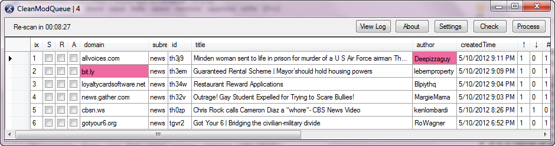
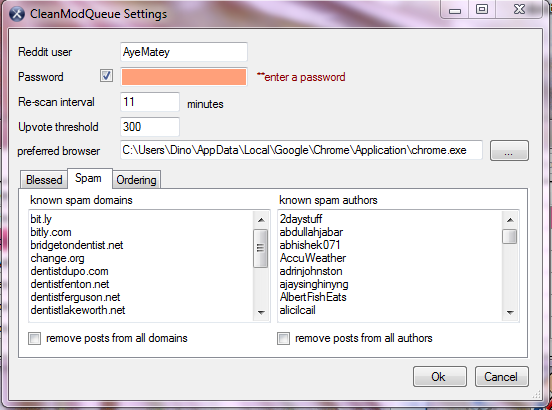
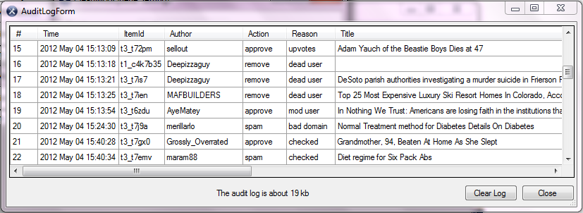

# CleanModQueue
A program to automatically and continuously clean the moderator queue on reddit, via [the public Reddit API](https://github.com/reddit/reddit/wiki/API) .

[Reddit](http://www.reddit.com) is the social news and discussion site. Within Reddit, moderators are responsible for responding to reports, and removing or approving posts in their queue (aka the modqueue). In some busy reddits, the modqueue gets lots of noise traffic - posts referring to spam domains, or posts from known spammers.

This tool monitors the mod queue and applies heuristics to keep the queue clean. It removes posts that appear to be spam, and approves posts that appear to be good ones. The tool does this based on settings provided by the moderator.

When a moderator uses this tool, it helps keep the modqueue clean. The moderator still needs to monitor and personally attend to the modqueue, but by using this tool, much of the busy work is eliminated.

[More Info](./Usage.md)
